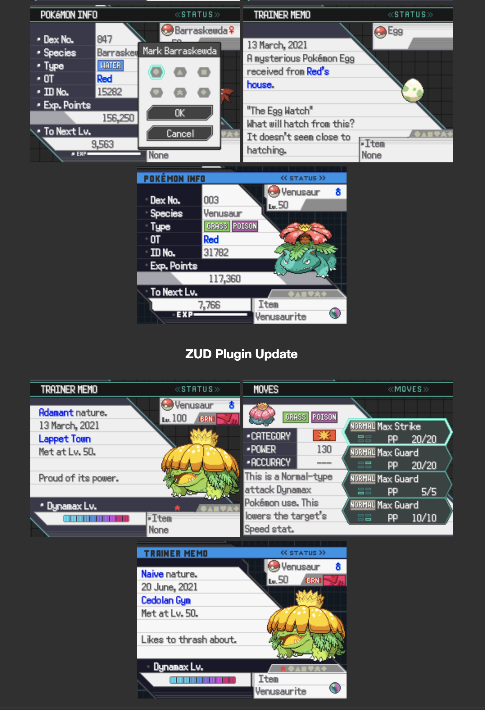
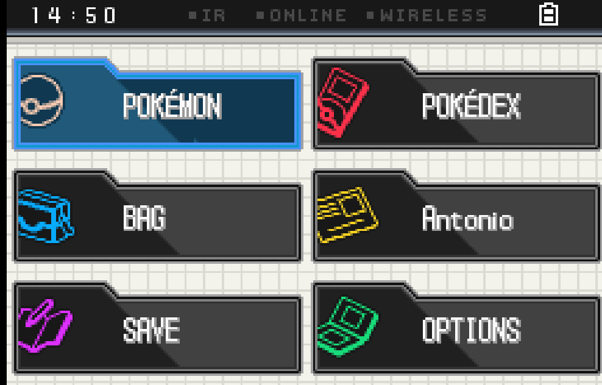
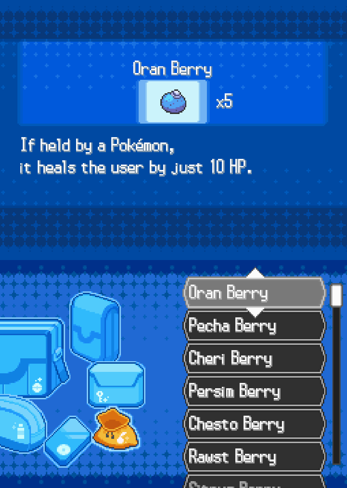
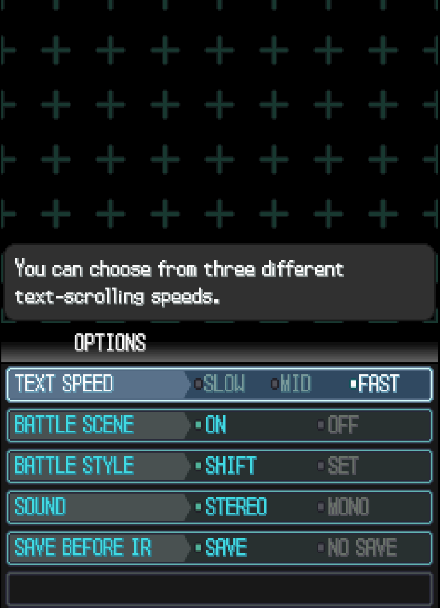
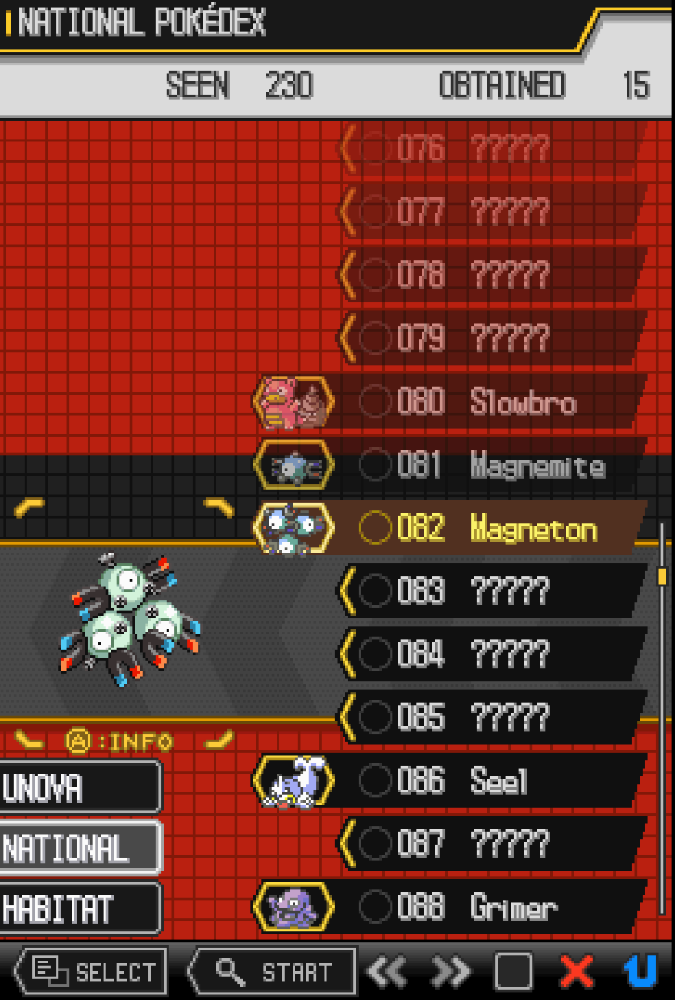

# Gen 5 UI design guide for agents

**Status:** design reference and proposed web styling; not a shipped editor theme.
**Default web direction:** subtle Gen 5 influence, charcoal surfaces, teal accents,
conventional typography, and the existing multi-record editing workflow.

Open the [visual reference](gen5-ui-reference/index.html) beside this guide. It
contains working sample controls, a Pokémon editor mockup, game-layout diagrams,
and all five supplied references. Open the HTML file directly, or serve the
repository and visit `/docs/gen5-ui-reference/index.html`. Its sibling CSS, script,
and assets must stay together. No ROM, network service, font download, build step,
or application state is required. The app's production build does not publish this
documentation page automatically.

## 1. Start here

Before generating a screen, declare its **target profile**, **screen family**,
**primary task**, and **available space**. Then choose a layout and components from
this guide. A teal border and pixel font alone do not establish the style.

| Decision | Game-screen profile | Web-application profile |
| --- | --- | --- |
| Coordinate system | 256×192 logical pixels per DS screen | Responsive CSS layout; text remains browser-rendered |
| Typography | Target game's verified bitmap font and glyph metrics | System sans-serif; monospace for IDs, code, and numeric inspection |
| Geometry | Integer coordinates; stepped/chamfered shapes; crisp layered edges | Mostly rectangular; small corner cuts on decorative headings or panel edges |
| Color | One screen family can dominate the whole composition | Charcoal dominates; teal indicates current context and selection |
| Information | Fit a deliberately bounded amount per screen | Preserve useful density; wrap, scroll, and progressively disclose details |
| Input | Explicit cursor order, confirm/cancel, and touch targets where supported | Native links, buttons, form fields, keyboard focus, pointer, and touch |
| Texture | Screen-specific grids, crosses, and bands | Faint grid in empty framing areas; solid surfaces behind text |
| Fidelity claim | Reproduction requires target-specific assets and runtime checks | An intentional adaptation, not an exact game recreation |

**Shared visual grammar:** strong title bars, aligned label/value regions, flat
planes separated by crisp edges, a consistent selection marker, controlled
diagonals, limited accent colors, and meaningful empty space around the subject.

### Evidence labels

- **Observed:** visible in one of the supplied images. A still image establishes
  appearance, not timing, input behavior, asset formats, or engine implementation.
- **Inferred:** a reusable design principle suggested by those observations.
- **Proposed:** a deliberate rule or value for new work, including every web token
  below. These values are not extracted native palette entries.
- **Unverified:** details needing a target ROM, font, source asset, or runtime
  check. Never silently promote these into established facts.

## 2. Reference atlas

The four individual captures were supplied as Pokémon White 2 screens. They are
enlarged and/or cropped captures, not native-resolution assets. Their dimensions
and colors must not be used to infer exact DS coordinates or palette indices.
The summary collage is explicitly an adapted reference. BW2 observations do not
establish BW1 parity; verify Black/White separately when targeting those games.

### A. Summary and trainer memo — adapted reference

[Full image](gen5-ui-reference/assets/summary-adaptations.png)



**Observed:** dark title strip; thin teal or blue accent; dark label column and
light value plane; large diagonal separation between information and sprite;
horizontal row rules; compact type badges; small identity and held-item panels.
The modal uses a solid light panel with a hard dark edge.

**Inferred:** use a strong reading axis for data, with the subject anchored in a
separate visual region. A diagonal can divide roles without tilting the text.

**Proposed web adaptation:** rectangular record rows, a compact sprite/name/type
group, aligned statistics, and a ruled expanded form. Put a small diagonal on the
section marker rather than slicing through fields or clipping their focus rings.

**Limit:** the collage includes plugin UI, later-generation species, Mega forms,
and Dynamax content. Its mechanics, assets, blue header variant, and exact panel
layouts are not evidence of stock White 2. Ignore webpage headings and separators
outside the game panels when deriving the visual grammar.

### B. Bottom main menu

[Full image](gen5-ui-reference/assets/white2-main-menu.png)



**Observed:** two columns of three large tiles; raised tab-shaped upper-left edge;
dark diagonal tone split; multiple hard border steps; individual icon colors;
cyan/blue selected tile; quiet pale grid behind the tiles.

**Inferred:** navigation destinations are large, predictable units. The selected
tile changes its surface and edge, not just its label color.

**Proposed web adaptation:** compact top navigation with a teal active rule and
tinted surface; use the six-tile composition only for a landing menu. Keep category
colors on icons or badges, not on every page background. Do not add decorative
wireless, clock, or battery indicators to an editor.

### C. Bag

[Full image](gen5-ui-reference/assets/white2-bag.png)



**Observed:** saturated blue environment; cross motifs and denser patterned bands;
an item detail region above; pocket illustrations and stacked framed rows below;
light selected row with triangular markers; a visible scrollbar.

**Inferred:** separate selection from explanation. A category change and an item
change are different levels of navigation. Texture belongs to the environment.

**Proposed web adaptation:** use this relationship for item browsers and help
panels, with a stable selected item and adjacent detail. Blue is a bag-family
example, not the default global web background. This pattern does not authorize
replacing Pokeweb's multi-record cards with a list/detail workflow.

### D. Options

[Full image](gen5-ui-reference/assets/white2-options.png)



**Observed:** a dark cross-pattern field, wide contextual help box, title band,
and aligned rows; left label segments have diagonal ends; values have small
markers; the active row has a brighter frame and surface. The selected value and
currently active row are separate visual signals.

**Inferred:** preserve the distinction between where the user is navigating and
what value is set. Group short mutually exclusive choices visibly.

**Proposed web adaptation:** labelled radio groups for settings, labelled inputs
for arbitrary values, and contextual help associated through `aria-describedby`.
Give keyboard focus its own external outline. Do not reproduce the low-contrast
unselected text from the capture in web controls.

### E. Pokédex

[Full image](gen5-ui-reference/assets/white2-pokedex.png)



**Observed:** black header with yellow edge; red grid; ordered dark rows with
angled ends; number/name alignment; yellow selection marker and label; a subject
detail region; visible lower action strip. Unknown entries use question marks.

**Inferred:** numbering and stable alignment make a long catalog scannable. The
selected row has both a location marker and a changed surface.

**Proposed web adaptation:** stable record IDs, aligned names, a teal edge marker
and a quiet selected surface. Keep the red/yellow combination within this family
when illustrating the game. In an editor, use explicit “Unavailable” or “Not
loaded” text when appropriate; discovery-state question marks imply a game rule.

## 3. Web design tokens

These **proposed** values are implemented in the companion's `reference.css`.
All declarations are scoped to `.g5-reference`. Prefix future shared tokens with
`--g5-`; use semantic names rather than naming a color after one editor.

| Token | Value | Role |
| --- | --- | --- |
| `--g5-bg` | `#171b1d` | Page background |
| `--g5-surface` | `#202628` | Record and component surface |
| `--g5-raised` | `#293134` | Raised control or hover surface |
| `--g5-inset` | `#121718` | Inputs and recessed toolbars |
| `--g5-text` | `#edf2ef` | Primary text |
| `--g5-muted` | `#a8b5b2` | Secondary, still readable text |
| `--g5-line` | `#3c4b4a` | Decorative separators; not a sole control boundary |
| `--g5-control-line` | `#7d918d` | Input and button boundaries |
| `--g5-accent` | `#62d6bd` | Active context and selected marker |
| `--g5-selected` | `#203c36` | Selected surface |
| `--g5-focus` | `#b2f5e6` | Keyboard outline |
| `--g5-warning` | `#efca78` | Unsaved indicator, with text |
| `--g5-error` | `#ffabab` | Validation error, with text |
| `--g5-space-1/2/3/4/6/8` | `4/8/12/16/24/32px` | Spacing scale |
| `--g5-radius` / `--g5-cut` | `3px` / `8px` | Small control radius / decorative corner cut |
| `--g5-control-height` | `44px` | Default minimum interactive height |
| `--g5-motion` | `120ms` | Color/border/surface feedback |
| `--g5-font` | `system-ui, -apple-system, BlinkMacSystemFont, "Segoe UI", sans-serif` | Web text |
| `--g5-mono` | `ui-monospace, "SFMono-Regular", Consolas, monospace` | Technical and numeric text |

### Typography and density

Use 16px body text, 14px form labels and editable values, 12px supporting text,
18–24px panel titles, and 1.5 line height for prose. Small specimen captions and
statistic abbreviations may use 10–11px text; essential instructions must not.
Numeric statistics use tabular figures. Large headings belong to the
reference/documentation shell, not repeated editor panels. Use sentence case for
controls and short uppercase labels sparingly. Do not make form text scale in
`vw`, depend on installed Rubik, or apply pixel fonts globally.

Web hit areas remain at least 44px high in this profile; a visually small marker
can sit inside a larger button. Dense data can use tighter noninteractive rows.
Wrap long names and values without expanding the page width. Never hide required
content behind a tooltip or make a truncated name the only accessible label.

### Geometry, texture, and sprites

Use one crisp 1px separator per boundary. A second inset edge is appropriate on a
featured frame, not every nested field. Use small radii rather than pill buttons.
Use an 8px diagonal only on noninteractive decoration, or on a background layer
whose shape cannot clip the control's outline or hit target. Keep text horizontal.

The web reference uses a faint 24px square grid on decorative framing only. Text,
forms, and lists sit on solid surfaces. Avoid glass blur, broad soft shadows,
beveled text, scanlines over content, and competing patterns within one panel.
These are proposed restraint rules for this web profile, not claims that the
games never use gradients, rounded shapes, or shadows.

Reuse appropriate local sprites with `image-rendering: pixelated`. The companion
copies four existing 40×30 repository icons and displays them at 80×60 (2×).
These icons are sample illustrations, not verified stock BW2 screen assets. The
guide supplies no new bitmap font or game-extracted assets. For native work, use
the target's verified resources. If those are unavailable, mark the result as a
layout prototype with placeholder typography.

### Motion

Feedback uses the motion token for color and border changes. Selection is stable;
no automatic blinking cursor, looping background, sprite motion, or sound is
needed in the web profile. Honor `prefers-reduced-motion: reduce` with zero
transition duration. Static captures provide no evidence for animation timing.

## 4. Component recipes and states

| Component | Construction | Behavior and semantics |
| --- | --- | --- |
| Title bar | Solid dark band, short title, one accent rule, optional context at right | Heading hierarchy remains meaningful; context wraps on narrow screens |
| Navigation | Flat rectangular links; current destination gets tinted fill and an edge | Use links and `aria-current="page"` for routes; use actual tab semantics only for a tab widget |
| Record card | Sprite/name/types at left, ruled statistics at right, detail beneath | Multi-record scanning remains possible; expansion is a button with `aria-expanded` and `aria-controls` |
| Label/value row | Stable label column, clear value surface, optional help | Use native labels and fields; preserve numeric alignment without clipping long strings |
| Badge | Small outlined rectangle; type or status text | Type color supplements the label; status badges include words, not just colored dots |
| Selectable list | Aligned number and label, consistent rows, separate scroll area only when needed | Match semantics to the task: navigation links, selection buttons, or a properly implemented listbox |
| Option group | Label plus 2–3 short choices with persistent indicators | Native radios for one value; checkboxes for independent flags; arrows work through native radio behavior |
| Input | Solid inset surface, visible boundary, associated label | Error text and `aria-invalid`; invalid input never appears committed |
| Button | Crisp boundary, 44px hit area; accent fill for one primary action | Native button; disabled actions have an explanation when needed |
| Dialog | Solid framed panel and quiet backdrop | Labelled native modal dialog; sensible initial focus, Escape, and focus return |
| Help panel | Solid raised surface, accent at the leading edge | Persistent readable guidance; do not move keyboard focus when help changes |

### State contract

| State | Visual signal | Meaning |
| --- | --- | --- |
| Default | Neutral surface and readable label | Available control or unselected record |
| Hover | Raised surface/border | Pointer feedback; not stored selection |
| Keyboard focus | 2px light outline, offset 3px | Current keyboard destination; works on selected controls too |
| Selected/current | Teal leading/bottom rule plus tinted surface and semantic state | Persistent choice or location; does not imply focus |
| Disabled | Native disabled behavior; muted surface and text without opacity on the whole page | Unavailable action; no false promise of interaction |
| Error | Error-colored border, explicit message, `aria-invalid="true"` | User input needs correction; preserve entered text while explaining it |
| Unsaved/changed | Amber marker and “Sample changes” in the demo | Change status; never reuse error red or selected teal to mean dirty |

The companion includes labelled frozen hover/focus swatches for comparison.
Those swatches are illustrations; real controls still respond to actual hover and
`:focus-visible`. A selected value keeps its marker when keyboard focus moves.

### Accessibility and responsive defaults

Provide a skip link, visible focus, associated labels, meaningful headings, and
text announcements for filter results. Use color plus shape/text for state.
Target at least 4.5:1 contrast for ordinary text and 3:1 for essential control
boundaries/focus against adjacent surfaces. Measure the actual combinations;
the decorative separator token is intentionally quieter and cannot carry state
alone. Disabled controls still have readable explanatory context.

Use a sidebar/main grid on wide screens. At 1100 CSS pixels or below, stack
filters above records; at 700 or below, stack record identity/stat regions and
form columns. Let navigation wrap. Use `min-width: 0` for grid/flex children.
At 200% browser zoom and at 360px width, keep all essential actions reachable
without horizontal page scrolling. Preserve text size instead of shrinking the
entire application to fit. Honor reduced motion and retain native focus/selection
indicators in forced-color environments.

## 5. Game-screen profile

The companion's game diagrams demonstrate **proposed composition only**. Their
vector text, arbitrary sample fields, and browser rendering are not a raster or
hardware fidelity test. The five original images remain the visual evidence.

### Canvas and composition

- Treat each screen as its own 256×192 coordinate space. A paired preview is two
  frames plus an external hinge/gap; the gap does not consume in-game pixels.
- Author pixel assets and text placement on integer coordinates. For raster
  previews, use 1×, 2×, or 3× nearest-neighbor display. A reduced image in the
  reference atlas is for browsing; open its source before judging pixels.
- Establish a title band, content region, and action/help region before styling.
  As a starting layout budget, reserve 20px for a title and 16px for actions,
  leaving 156px for content. These are proposed budgets, not measured constants.
- Assign each screen a task. The bag and options references support a useful
  detail/help-above and selection-below relationship. This is not a universal rule
  for every Gen 5 screen; decide explicitly when authoring a different family.
- Use a large subject sprite only if it does not compete with labels and values.
  Diagonal planes can separate them, but text rectangles stay axis-aligned.

### Text budget and navigation

Measure strings with the actual bitmap glyph advances, line spacing, and usable
rectangle width. Do not convert screenshot character counts into font metrics.
With a hypothetical 12px line advance, a 48px description region holds at most
four lines; that example is a budget calculation, not a claim about the ROM font.
Test the longest supported name, numbers with the maximum digit count, localized
text when in scope, and empty/unavailable values. Use paging or explicit scrolling
when content exceeds the budget; never silently crop required information.

Define initial focus, directional neighbors, list scrolling, confirmation,
cancellation, and focus restoration. A setting's selected value stays marked
while the cursor moves to another row. Give the cursor a border, chevron, or
pointer in addition to color. Use touch targets only on the intended touch screen;
make action legends match implemented input. Do not derive wrap-around or repeat
timing from a still image.

### Target verification boundary

For an actual game implementation, record the game (BW1 or BW2), region/revision,
font and glyph support, screen/engine ownership, BG/OBJ resource allocation,
palette and tile constraints, and text rendering path. Confirm these in the
target before promising the layout will run. This guide intentionally provides
no archive IDs, palette counts, VRAM budgets, hook addresses, or patch instructions.
Visual similarity does not establish binary compatibility. Hardware/runtime
validation remains a separate task; do not claim it from a browser mockup.

## 6. Pokeweb adoption map

The current app uses TypeScript DOM rendering with shared and editor-specific
styles. It has no shared Gen 5 theme layer. The Pokémon page renders a fixed
filter area and multiple cards with identity, types, abilities, base statistics,
and lazily expanded sections. The reference preserves that multi-record model.

| Area | Existing integration | Intended later change |
| --- | --- | --- |
| Shell and routes | `src/main.ts`, `src/styles/legacyLayout.css` | Introduce scoped theme tokens and restrained navigation styling; retain destinations and availability logic |
| Shared forms | `src/styles.css`, `src/styles/legacyFields.css` | Apply consistent boundaries, spacing, focus, and status styling |
| Pokémon cards | `src/ui/pokemonEditor.ts`, `src/styles/legacyPokemon.css` | Restyle identity/stat regions and expanded details without replacing the multi-card workflow |
| Interactions | `src/ui/pokemonInteractions.ts` | Preserve expansion, filtering, editable metadata, autocomplete, bulk actions, and lazy rendering hooks |
| Data and persistence | `src/pokeweb/pokemonModel.ts`, `src/pokeweb/persistence.ts` | Preserve model validation, raw/readable synchronization, dirty marking, and debounced persistence |

For later integration, introduce theme primitives in a dedicated shared style
layer and migrate the shell plus one editor before expanding coverage. Inspect
the cascade rather than appending unbounded overrides. Preserve class names and
`data-narc`, `data-field-name`, `data-type`, `data-autofill`, and record identifiers
used by interactions. Do not change routes, availability checks, binary layouts,
project schemas, export, or dirty-state semantics as part of visual styling.

The browser demo uses four illustrative records and ordinary labelled fields.
Filtering combines search and type, with all types as the default. Expand/collapse
works per record; one record starts expanded. Valid numeric changes are held only
in memory, invalid drafts remain visible, and resetting uses a confirmation
dialog. It deliberately has no persistence or export. Its change indicator is
labelled “Sample changes”; the live app's existing dirty workflow remains the
integration contract. Non-Pokémon destinations in the mock navigation are shown
as unavailable examples with an explanation.

## 7. Agent generation workflow

1. Read the target profile and the relevant reference family. State which details
   are observed and which you are proposing.
2. List the user's tasks and content budget. For Pokeweb, inspect existing DOM,
   interaction hooks, and model boundaries before changing markup.
3. Lay out title, selection, detail, and actions in neutral rectangles. Confirm
   reading order and input behavior before adding diagonals or texture.
4. Apply the named tokens and component recipes. Keep one family dominant. Use
   color/text/shape redundantly for status and selection.
5. Exercise real states: long labels, empty results, unavailable data, selected
   and focused simultaneously, invalid input, and unsaved changes.
6. Review the result alongside the source image and at the target scale. Report
   actual checks and remaining target-specific unknowns.

| Prefer | Avoid |
| --- | --- |
| A single accent rule that explains the active section | Neon borders and clipped corners on every element |
| Stable label columns and a separate sprite area | Diagonals cutting through text or controls |
| Native web fields with Gen 5-inspired framing | A canvas-only form or pixel font imposed on dense editing |
| Faint environment texture and solid content | A red grid, blue crosses, and teal options styling mixed in one web panel |
| Honest source labels and proposed token names | Calling the plugin collage stock BW2 or guessed colors native palette values |
| Explicit empty, error, selected, and focus states | Color-only communication or hover as the only way to reveal actions |

### Copyable brief: web editor

```text
Use docs/gen5-ui-design-guide.md, web-application profile, summary/options family.
Build a subtle charcoal-and-teal interface using its --g5-* tokens, conventional
system typography, crisp separators, and small decorative corner cuts. Preserve
the existing navigation, search/type filters, multiple Pokémon cards, and lazy
expanded panels. Keep interaction metadata, model validation, dirty tracking,
persistence, and export behavior intact. Do not impose a DS aspect ratio.
Demonstrate default, hover, keyboard focus, selection, disabled, error, and changed
states. Verify keyboard access, long labels, empty results, 360px width, 200% zoom,
and reduced motion. Identify proposed adaptations and report only completed checks.
```

### Copyable brief: game screen

```text
Use docs/gen5-ui-design-guide.md, game-screen profile, options family.
Design a paired 256×192 settings screen: contextual help above, setting rows and
confirm/cancel actions below. Use a dark field, teal accents, aligned label/value
regions, hard stepped borders, and separate cursor and selected-value markers.
Allocate integer pixel rectangles and measure every string with the verified
target font. Declare the exact target game, region/revision, assets, input order,
and resource limits before native implementation. If those inputs are unavailable,
deliver a clearly labelled layout prototype and list the missing verification.
Do not infer BW1/BW2 parity, native colors, memory budgets, or animation timing from
the supplied screenshots. Test longest text, navigation, overflow, and focus return.
```

## 8. Review checklist and provenance

- Does the screen name its profile and dominant family?
- Are source observations distinct from new decisions and unverified details?
- Is the primary task clear without decorative effects?
- Are labels, values, subject art, help, and actions spatially consistent?
- Can selection, keyboard focus, errors, and unsaved changes be distinguished?
- Do all interactive examples work by keyboard, with readable labels and feedback?
- Are narrow layouts, zoom, long content, and empty states usable?
- Are game assets crisp at integer scale and native fidelity claims verified?
- Are all assets local and all document links relative?

The five reference PNGs preserve the supplied image pixels, with textual metadata
removed. Their filenames describe their content rather than their original local
capture paths. The four small example sprites are copies of existing repository
icons. No rights or stock-game provenance is inferred from their availability.
No external reference research, ROM asset extraction, or in-game verification was
performed to create this guide. See [validation notes](gen5-ui-reference/validation.md)
for the checks performed on this documentation and browser companion.
